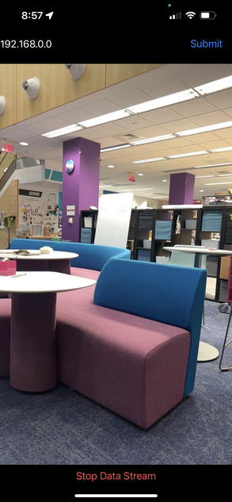

# ARKit to ROS2 Bridge
This package along with the ARKitROS2Bridge app allow data to be streamed via UDP packets from an iOS device to another device on the same network or on a wired connection. Currently, the app broadcasts camera pose (from ARKit), live camera images, and GPS location.

# Requirements
* Device with ROS2 Foxy or Humble ('PC')
* MacOS device with XCode 14 ('Mac')
* iOS 16 device ('phone')

# Install
1. Clone the `field_autonomy` repository to both your PC and Mac.
2. Open `ARKitROS2Bridge` in XCode. Change the Signing settings to your personal developer certificate. 
3. Enable Developer Mode under Privacy & Security on your phone. 
4. Build the app onto your phone. Allow camera and location permissions when prompted.

5. Build and source this package, `arkit_data_streamer` on your PC with
```
colcon build --symlink-install
source install/setup.bash
```

# Run
## Choose Connection IP
Because the data streamer communicates via UDP packets, the ARKitROS2Bridge app takes an IP address as an input to stream data to the correct location.

### Wired Connection
**Note**: Your phone must have a SIM card and have mobile hotspot capability.

Plug your phone into your PC. Open a terminal and run
```
ip link
```
to display available networks. Your output may look similar to this:
```
1: lo: <LOOPBACK,UP,LOWER_UP> mtu 65536 qdisc noqueue state UNKNOWN mode DEFAULT group default qlen 1000
    link/loopback 00:00:00:00:00:00 brd 00:00:00:00:00:00
2: eno2: <NO-CARRIER,BROADCAST,MULTICAST,UP> mtu 1500 qdisc fq_codel state DOWN mode DEFAULT group default qlen 1000
    link/ether cc:48:3a:2e:c0:5e brd ff:ff:ff:ff:ff:ff
    altname enp0s31f6
3: wlo1: <BROADCAST,MULTICAST,UP,LOWER_UP> mtu 1500 qdisc noqueue state UP mode DORMANT group default qlen 1000
    link/ether 34:7d:f6:94:bd:3a brd ff:ff:ff:ff:ff:ff
    altname wlp0s20f3
4: enxf665a65f4345: <BROADCAST,MULTICAST,UP,LOWER_UP> mtu 1500 qdisc fq_codel state UP mode DEFAULT group default qlen 1000
    link/ether f6:65:a6:5f:43:45 brd ff:ff:ff:ff:ff:ff
```
Look for the name of your phone's network, it should begin with `enx`. Then use
```
ip a show [YOUR_PHONE_NETWORK]
```
to find the IP address. It will be listed as
```
inet [IP_ADDRESS]
```
in the output.

### Wireless Connection
Make sure your phone and PC are connected to the same wireless network. Follow the same procedure as above in the wired connection section, except look for your wireless network name. It should begin with a `w` (`wlo1` in the example above). Find the ip address for the network with `ip a show`.

### Wireless Access Point Connection
If you setup your PC as a wireless access point (the field autonomy project uses a Raspberry Pi as an access point), you can connect your phone to the PC's network. The IP you will need is the router IP, found by navigating to the Wifi settings on the phone, opening the info for the access point, and scrolling down to the IP address listed next to "Router".

## Stream and Receive Data
1. On the phone, open up the ARKitROS2Bridge app and type the IP address found in the previous sections into the field at the top.
2. Hit return on the keyboard and the `Submit` button. The `Start Data Stream` button at the bottom should now be enabled. 
3. Press `Start Data Stream` to start streaming data, and press again to stop.

4. On the PC, run the following command:
```
ros2 launch arkit_data_streamer launch_data_servers.py
```
This will create three nodes:
`pose_server`, `image_server`, and `gps_server`. These will publish to the topics: `/ios_clock`, `/device_pose`, `/gps_coords`, `/camera/camera_info`, and `/camera/image_raw/compressed`. A transform from the device pose to the `odom` frame is also published to `/tf`. 

Custom nodes can be written to access any of these topics. Included in this package is a node called `odometry_recorder`, which can be run with
```
ros2 run arkit_data_streamer odometry_recorder
```
It places markers in RViz2 at the phone position and generate a CSV with the movement path of the phone. The path can be visualized with the `plot_path.py` script. An RViz2 config file is also included in the package to visualize the phone pose.

## Troubleshooting
If you get an error related to image transport like the following when trying to view the image in RQT:
```
Unable to load plugin for transport image_transport_compressed_sub
```
Install image-transport-plugins from apt.
```
sudo apt install ros-${ROS_DISTRO}-image-transport-plugins
```

# Code Architecture
## ARKitROS2Bridge App


### Files
* `ARKitROS2BridgeApp.swift`
    * App delegate
* `ContentView.swift`
    * Contains UI elements (AR camera view, IP address field, data streaming start/stop)
* `ARViewController.swift`
    * Contains ARViewController class
    * Controller for the AR session
    * Handles GPS location updates
    * Notable functions:
        * `getGPSCoordinates()`: Returns GPS coordinates with timestamp, formatted as a String
        * `getVideoFrames()`: Returns current AR session frame as a UIImage with a timestamp
        * `getCameraCoordinates()`: Returns position and orientation of the camera as a 4x4 transformation matrix with a timestamp, formatted as a String
        * `getCameraIntrinsics()`: Returns camera intrinsic data formatted as a String and converted into bytes
* `DataStreamer.swift`:
    * Contains DataStreamer class
    * Handles conversion of ARKit information to UDP data packets
    * Functions:
        * `setupUdpConnections()`: Creates UDP connections using ports from Config and IP address inputted in the app
        * `startButtonTapped()`: Starts/stops timers to transmit data every 0.1s
        * `transmitPoseData()`, `transmitGPS()`: Broadcast UDP packets containing the corresponding information
        * `transmitImages()`: Scale down and compress images for processing speed. Split images into smaller packets and broadcast one at a time.
* `UDPBroadcastConnection.swift`:
    * Contains UDPBroadcastConnection class
    * Setup connections and broadcast UDP packets to given ports on a given address
* `Config.swift`: 
    * Store port numbers for each data type

## arkit_data_streamer Package
### System Architecture


### Nodes
* `pose_server.py`
    * Contains PoseServerNode
    * Receives & processes phone pose UDP packets sent by the app
    * Calculates offset between phone timestamp and ROS time
    * Publishes pose as msg type PoseStamped to topic `/device_pose`
    * Publishes iOS-ROS time offset as msg type Float64 to topic `/ios_clock`
    * Publishes a transform from device frame to odom frame to topic `/tf`
* `image_server.py`
    * Contains ImageServerNode
    * Receives & processes image & camera intrinsics UDP packets sent by the app
    * Subscribes to `/ios_clock`
    * Publishes images as msg type CompressedImage to topic `/camera/image_raw/compressed`
    * Publishes camera intrinsics as msg type CameraInfo to topic `/camera/camera_info`
* `gps_server.py`
    * Contains GPSServerNode
    * Receives & processes GPS coordinate UDP packets sent by the app
    * Subcribes to `/ios_clock`
    * Publishes coordinates and timestamp as msg type CoordinateStamped (custom, included in `gps_interfaces` in the `field_autonomy` repo) to `/gps_coords`
* `odometry_recorder.py`
    * Contains OdometryRecorderNode
    * Subscribes to `/device_pose`
    * Publishes markers at device positions as msg type Marker to topic `/odom_markers`
    * Writes device positions to a CSV file called `robot_path.csv` in the same directory as the node. Will overwrite previous path file by default.

### Additional Files
* `handle_udp.py`
    * Contains `extractUDP(udp_port)`
    * Continuously reads and returns data from UDP packets from the given port
* `helper_functions.py`
    * Contains `convert_matrix_to_frame(transform_matrix)` and `TFHelper`
    * `TFHelper` is used to publish to the `/tf` topic
* `plot_path.py`
    * Script to plot path recorded in `robot_path.csv` by the odometry_recorder node
* `launch_data_servers.py`
    * Launch file to create all 3 data server nodes at once